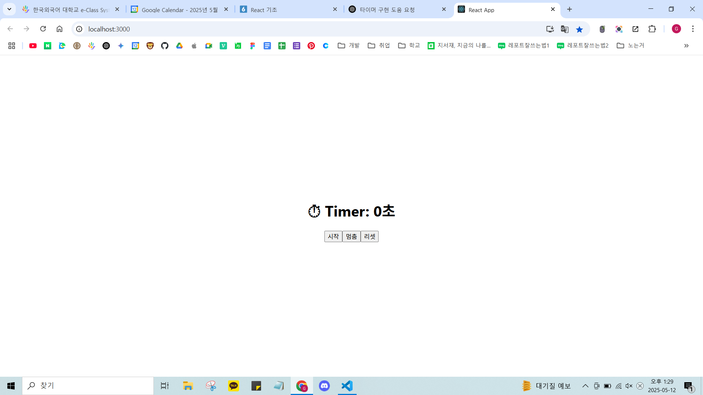
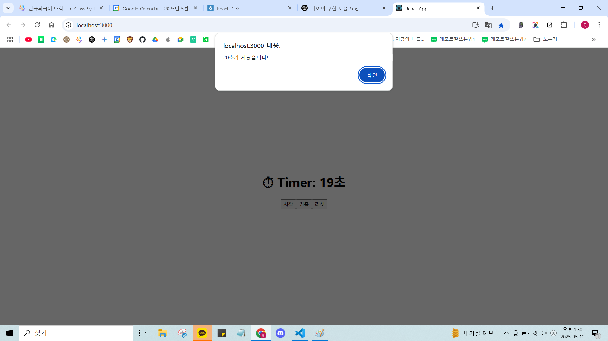
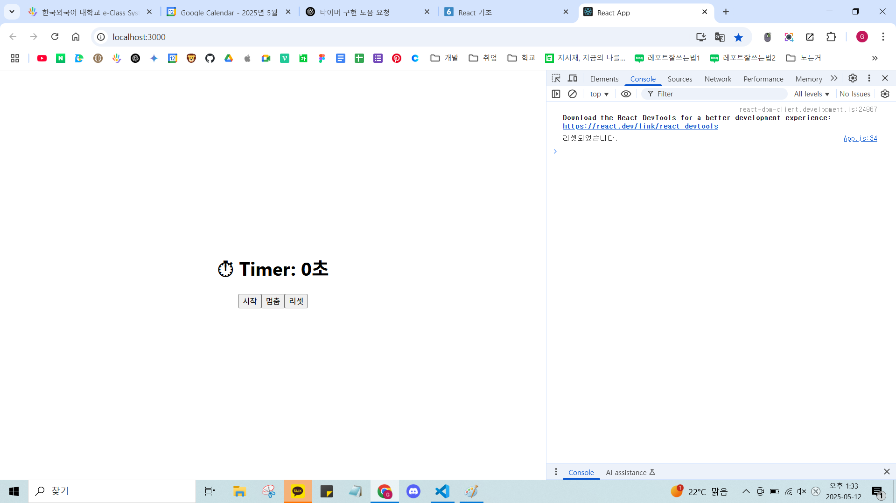

# React Timer App

20초 타이머 과제입니다.  
시작 버튼을 누르면 1초씩 증가하고, 20초가 되면 자동으로 멈추고 alert가 뜹니다.  
리셋 버튼을 누르면 타이머가 0으로 초기화되며 콘솔에 "리셋되었습니다"가 출력됩니다.

---

## 🖼 실행 화면

###  타이머 시작 전

###  20초 도달 (alert 출력)

###  리셋 후 (콘솔 출력 확인)

